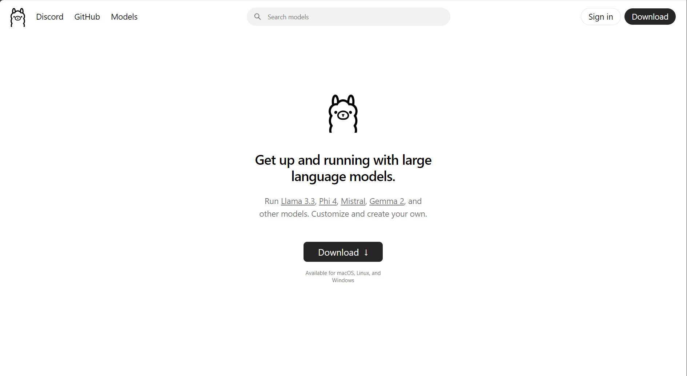

<Center>

# Empowering Developers with Local AI 🚀

### Unlocking Developer Productivity with Privacy, Speed, and Control

</Center>

---

<Center>

## 📋 Agenda

1. Why Local AI Solutions Matter
2. Ollama
3. LM Studio
4. Open Web UI
5. Bolt.diy
6. Continue.dev + LM Studio (demo)
7. Key Takeaways & Resources
8. Q&A

</Center>

---

<Center>

## 🎯 What to Expect

- **Learn** how local AI tools can empower your workflow.
- **Discover** privacy-first, cost-effective solutions.
- **See** real-world demos with tools like **Ollama, Continue.dev, LM Studio, and Open Web UI.**

</Center>

---

<Center>

<header>

## 🧑‍💻 About Me

</header>

<div>

- **Raymon Schouwenaar**
- <Age dob="14-05-1988" />
- **Tech Lead** at SBB via ShareValue.
- Passionate about:
    - Frontend Development
    - Integrating AI into development workflows.
    - Sharing knowledge.
    - Help junior developers grow.

</div>

</Center>

---

<Center>

## Let's talk Local AI 🤖

</Center>

---

<Center>

## 🤔 Why Local AI?

- ✅ **Privacy**
- ✅ **Data Sovereignty**
- ✅ **Cost Efficiency** \*
- ✅ **Control**
- ✅ **Speed** \*

<div v-click>

_\* Yes you need more powerfull development computers_ 😅

</div>

</Center>

<!--

- ✅ **Privacy:** Your data stays on your machine.
- ✅ **Data Sovereignty:** Very low risk of leaks or external dependencies.
- ✅ **Cost Efficiency:** Save on expensive cloud subscriptions\*.
- ✅ **Control:** Customize tools to suit your needs.
- ✅ **Speed:** Run AI locally without internet latency\*.

Yes you need more powerfull development computers


 -->

---

<Center>

## 🔧 Tools Overview

- **Ollama:** Local AI model with API support.
- **LM Studio:** User-friendly interface for AI workflows.
- **Open Web UI:** Flexible, open-source alternative to ChatGPT.
- **Bolt.diy:** Build, maintain and run fullstack web apps with AI.
- **Continue.dev:** Copilot alternative that works with Ollama, LM Studio and more.

</Center>

<!--

- **Ollama:** Local AI model with API support.
- **LM Studio:** User-friendly interface for AI workflows.
- **Open Web UI:** Flexible, open-source alternative to ChatGPT.
- **Bolt.diy:** Build, maintain and run fullstack web apps with AI.
- **Continue.dev:** Copilot alternative that works with Ollama, LM Studio and more.

 -->

---

<Center>



_[Ollama🔗](https://ollama.com)_

</Center>

<!--

# Who has tried Ollama?

 -->

---

<Center>

## Platforms


</Center>

<!--

## Ollama runs the platforms

- MacOS
- Linux
- Windows
- Docker

 -->

---

<TwoCols bg="./images/ollama-llama-3-1.png">

<div class="flex gap-4 flex-col">

<HeaderWithLogo logo="images/ollama-logo.png" alt="Ollama logo">

</HeaderWithLogo>

## _Run open-source LLMs on your computer._

- ✅**Customization**
- ✅**Chat with your files**
- ✅**API**

</div>

</TwoCols>

<!--

- **Goal:** Run open-source LLMs on a local computer. Like LLama3.3, Phi4, Mistral and Gemma 2.
- **Customise:** Create your own version of an LLM by setting the temperature, system prompt, and more.
- **Chat with your files:** Can check files on your computer if you provide the path as context for a prompt.
- **API:** Easy to use API for integration with other tools. Or you could build a tool yourself. The API is highly inspired by the OpenAI API for ChatGPT.

 -->

---

<TwoCols bg="https://res.cloudinary.com/raymons/video/upload/v1737640806/dw2025/videos/ollama-llama3.1-terminal.mp4" videoPoster="./images/ollama-llama-3-1-terminal.png" typeBg="video">

<HeaderWithLogo logo="images/ollama-logo.png" alt="Ollama logo">

## Ollama via Terminal

</HeaderWithLogo>

- `ollama list`
- `ollama pull llama3.1:latest`
- `ollama run llama3.1:latest`

</TwoCols>

<!--

## Usage via Terminal

- You can use the command `ollama list` for showing all the downloaded LLM's
- You can use the command `ollama pull llama3.1:latest` for downloading the LLM
- You can use the command `ollama run llama3.1:latest` for starting a session with LLama3.1

Check the website of Ollama for all the LLM's that are available.

 -->

---

<Center size="max-w-4xl">

<HeaderWithLogo logo="images/ollama-logo.png" alt="Ollama logo">

## Ollama: API

</HeaderWithLogo>

<div class="flex flex-row gap-4 w-full">

<div>

### Request

```
curl http://localhost:11434/api/generate -d '{
  "model": "llama3.2",
  "prompt": "Why is the sky blue?",
  "stream": false
}'
```

</div>
<div>

### Result

```json
{
	"model": "llama3.2",
	"created_at": "2023-08-04T19:22:45.499127Z",
	"response": "The sky is blue because it is the color of the sky.",
	"done": true,
	"context": [1, 2, 3],
	"total_duration": 5043500667,
	"load_duration": 5025959,
	"prompt_eval_count": 26,
	"prompt_eval_duration": 325953000,
	"eval_count": 290,
	"eval_duration": 4709213000
}
```

</div>

</div>

</Center>

---

<Center>

<HeaderWithLogo logo="images/ollama-logo.png" alt="Ollama logo">

## Ollama: Comparison

</HeaderWithLogo>

- **More private and cost-effective than ChatGPT or GitHub Copilot.**

</Center>

---

<Center>

## 🖥️ LM Studio: AI Made Accessible

### Why Use LM Studio?

- 🧩 User-friendly interface for local AI models.
- 🔗 Seamlessly integrates with **Continue.dev.**
- ⚡ Practical use cases:
    - Code completion.
    - Refactoring.
    - Comment generation.

</Center>

---

<Center>

## 🌐 Open Web UI: AI Without Cloud

### Key Features

- 🛠️ Customize workflows locally.
- 🚀 Flexible open-source alternative to proprietary platforms.
- 🌍 Supports local LLMs for enhanced privacy.

</Center>

---

<Center>

## ⚡ Bolt.diy: Running AI Code Locally

### Highlights

- 🖥️ Execute AI-generated code directly on your machine.
- 🔧 Ideal for local testing and development.
- 🕒 **Note:** Demo not included in this session but covered in future workshops.

</Center>

---

<Center>

## 🎥 Live Demo: Continue.dev + DeepSeek Coder

### What You’ll See:

1️⃣ **Code Reviews:** Real-time suggestions for improving code.  
2️⃣ **Refactoring:** Simplify and optimize code with AI assistance.  
3️⃣ **Productivity Boost:** Simulated live coding with local AI tools.

</Center>

---

<Center>

## 🎁 Key Takeaways

- **Privacy-First Development:** Local AI keeps your data safe.
- **Affordable & Accessible:** No need for expensive subscriptions.
- **Powerful Alternatives:** **Continue.dev + Ollama** can rival GitHub Copilot.
- **Automation Made Easy:** Tools like **n8n** eliminate repetitive tasks.

</Center>

---

<Center>

## ❓ Q&A

Let’s discuss:

- Your concerns about local AI.
- How to integrate these tools into your workflow.
- Challenges and solutions for local AI adoption.

</Center>

---

<Center>

## 📂 Resources

- **Ollama:** [ollama.com](https://ollama.com)
- **LM Studio:** [lmstudio.ai](https://lmstudio.ai)
- **Open Web UI:** [openwebui.ai](https://openwebui.ai)
- **Continue.dev:** [continue.dev](https://continue.dev)
- **My Blog:** [byrayray.dev](https://byrayray.dev)

</Center>
