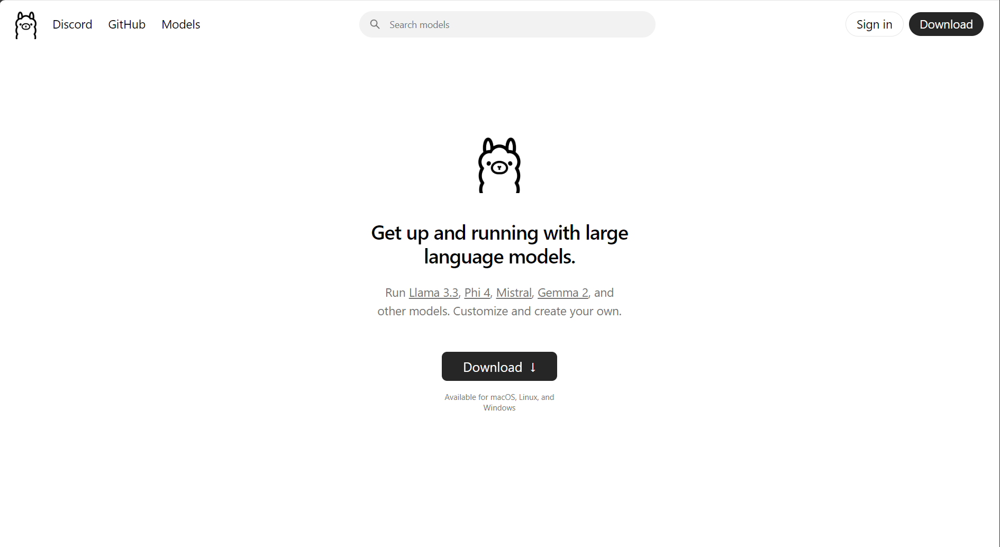
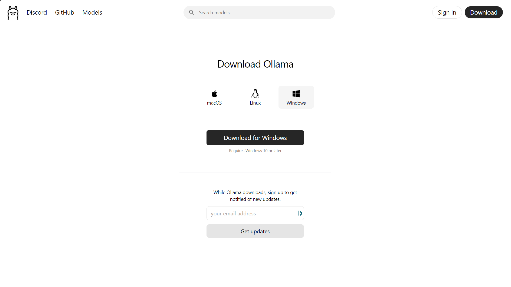

---
# You can also start simply with 'default'
theme: seriph
# random image from a curated Unsplash collection by Anthony
# like them? see https://unsplash.com/collections/94734566/slidev
background: https://cover.sli.dev
# some information about your slides (markdown enabled)
info: |
    ## Slidev Starter Template
    Presentation slides for developers.

    Learn more at [Sli.dev](https://sli.dev)
# apply unocss classes to the current slide
class: text-center
# https://sli.dev/features/drawing
drawings:
    persist: false
# slide transition: https://sli.dev/guide/animations.html#slide-transitions
transition: slide-left
# enable MDC Syntax: https://sli.dev/features/mdc
mdc: true
title: Empowering Developers with Local AI 🚀
author: Raymon S
---

# Empowering Developers with Local AI 🚀

---

## 📋 Agenda

1. Why Local AI Solutions Matter
2. Local AI Developer Tools
3. Key Takeaways & Resources
4. Q&A

---

## 🎯 What to Expect

- **Learn** how local AI tools can improve your workflow.
- **Discover** privacy-first and offline solutions.
- **See** real-world demos with:

<div class="flex flex-row gap-4 pt-4">
    <LmStudio />
    <OpenWebUI />
    <N8N />
    <Continue />
    <Ollama />
</div>

---

<header>

## 🧑‍💻 About Me

</header>

<div>

- **Raymon Schouwenaar**
- <Age dob="14-05-1988" />
- **Tech Lead** at SBB via ShareValue.
- Passionate about: - Frontend Development - Integrating AI into development workflows. - Sharing knowledge. - Help junior developers grow.

</div>

---

## Let's talk Local AI 🤖

---

## 🤔 What do I mean with Local AI?

Running LLM's on a local computer

<!--

# When I talk about local AI

- I mean running LLM's on my computer
- Not advanced AI like OpenAI or other companies
- But local LLM's helping me with development work

 -->

---

## 🌐 Local AI vs Cloud AI

| **Feature**       | L**ocal AI Tools**         | **Cloud AI Tools**                   |
| ----------------- | -------------------------- | ------------------------------------ |
| **Privacy**       | _High_                     | _Low_                                |
| **Cost**          | _One-time hardware cost_   | _Recurring subscription_             |
| **Control**       | _Full control over data_   | _Limited control controle over data_ |
| **Speed**         | _Depends on your hardware_ | _Most of the time fast_              |
| **Data Security** | _High_                     | _Variable_                           |

<!--
- ✅ **Privacy:** Your data stays on your machine.
- ✅ **Prevent Data Leaks:** Very low risk of leaks or external dependencies.
- ✅ **Cost Efficiency:** Save on expensive cloud subscriptions\*.
- ✅ **Control:** You control the data that goes in.
- ✅ **Speed:** Run AI locally without internet latency or even offline\*.
- ✅ **Data Security**: Locally your data is as secure as your computer.

## * Yes you may need a more powerful computer


 -->

---

## 🛠️ Use Cases for Local AI Tools

- **Code Completion**: Use tools like Continue.dev for intelligent code suggestions.
- **Code Review**: Automate code reviews with local LLMs.
- **Documentation**: Generate documentation using local AI models.
- **Data Analysis**: Perform data analysis without sending data to the cloud.
- **Customization**: Tailor AI models to specific project needs.

---

## 🔧 Local AI Tools

<div class="max-h-[200px] flex justify-center flex-row gap-4">
    <Card>
        <Ollama  size="small" /> 
        Run local AI model  with API support.
    </Card>
    <Card>
        <LmStudio  size="small" /> 
        User-friendly GUI for running local AI with API support.
    </Card>
    <Card>
        <OpenWebUI  size="small" />
        ChatGPT alternative that works with Ollama
    </Card>

</div>
<div class="max-h-[200px] flex justify-center flex-row gap-4">
<Card>
    <Continue  size="small" />
    Copilot alternative for Ollama, LM Studio and more.
</Card>
<Card>
    <BrowserUse  size="small" />
    Let AI automate your browser
</Card>

<Card className=" max-w-[250px]">
    <AutoGPT  size="small" />
    Create, deploy, and manage continuous AI agents to automate complex workflows
</Card>

</div>

<!--

### I want to introduce you to my favorite tools

#### **Ollama:**
With Ollama you can run local LLM's and they offer a API.

#### **LM Studio:**
LM Studio is a User-friendly interface for running local LLM's, and also offer a API.

#### **Open Web UI:**
Open Web UI is a Flexible, open-source alternative to ChatGPT. It's a true

#### **Continue.dev:**
Copilot alternative that works with Ollama, LM Studio and more.

- [Browser-use](https://github.com/browser-use/browser-use)
- [Bolt.diy](https://github.com/devbyray/bolt.diy)
- [n8n](https://github.com/n8n-io/self-hosted-ai-starter-kit)
[Pydantic](https://github.com/pydantic/pydantic-ai), [AutoGPT](https://github.com/Significant-Gravitas/AutoGPT), [Open Interpreter](https://github.com/OpenInterpreter/open-interpreter)

 -->

---

<LmStudio />

<!--

## Next tools is LM studio

 -->

---

<LmStudio hideTitle />

## LM Studio

- 🧩 User-friendly.
- 🔗 Intergrates with other tools
- 📴 Offline usage
- 📚 Large library of LLMs

<!--

## Why use LM Studio?

- 🧩 User-friendly interface for local AI models.
- 🔗 Integrates with coding assistants and other tools
- 📴 Offline usage
- 📚 Large library of LLMs from multiple sources like: Ollama and huggingface
- ⚡ Practical use cases:
    - Use local LLM's from Ollama and huggingface
    - Set system prompts, temprature, structured output

 -->

---

## 🌐 Open Web UI: AI Without Cloud

### Key Features

- 🛠️ Customize workflows locally.
- 🚀 Flexible open-source alternative to proprietary platforms.
- 🌍 Supports local LLMs for enhanced privacy.

---

## 🎁 Key Takeaways

- **Privacy-First Development:** Local AI keeps your data safe.
- **Affordable & Accessible:** No need for expensive subscriptions.
- **Powerful Alternatives:** **Continue.dev + Ollama** can rival GitHub Copilot.
- **Automation Made Easy:** Tools like **n8n** eliminate repetitive tasks.

---

## 📂 Resources

- **Ollama:** [ollama.com](https://ollama.com)
- **LM Studio:** [lmstudio.ai](https://lmstudio.ai)
- **Open Web UI:** [openwebui.ai](https://openwebui.ai)
- **Continue.dev:** [continue.dev](https://continue.dev)
- **My Blog:** [byrayray.dev](https://byrayray.dev)

---



_[Ollama🔗](https://ollama.com)_

<!--

# Who has tried Ollama?

 -->

---

## Platforms



<!--

## Ollama runs the platforms

- MacOS
- Linux
- Windows
- Docker

 -->

---

<TwoCols bg="../images/ollama-llama-3-1.png">

<div class="flex gap-4 flex-col">

<Ollama />

## _Run open-source LLMs on your computer._

- ✅**Customization**
- ✅**Chat with your files**
- ✅**API**
- ✅ Multiple opensource LLM's
    - LLama3
    - Mistral
    - Gemma 2
    - DeepSeek

</div>

</TwoCols>

<!--

- **Goal:** Run open-source LLMs on a local computer. Like LLama3, Mistral, Gemma 2, and DeepSeek.
- **Customise:** Create your own version of an LLM by setting the temperature, system prompt, and more.
- **Chat with your files:** Can check files on your computer if you provide the path as context for a prompt.
- **API:** Easy to use API for integration with other tools. Or you could build a tool yourself. The API is highly inspired by the OpenAI API for ChatGPT.

 -->

---

<TwoCols bg="https://res.cloudinary.com/raymons/video/upload/v1737640806/dw2025/videos/ollama-llama3.1-terminal.mp4" videoPoster="./images/ollama-llama-3-1-terminal.png" typeBg="video">

<Ollama hideTitle />

## Ollama via Terminal

- `ollama list`
- `ollama pull llama3.1:latest`
- `ollama run llama3.1:latest`

</TwoCols>

<!--

## Usage via Terminal

- You can use the command `ollama list` for showing all the downloaded LLM's
- You can use the command `ollama pull llama3.1:latest` for downloading the LLM
- You can use the command `ollama run llama3.1:latest` for starting a session with LLama3.1

Check the website of Ollama for all the LLM's that are available.

 -->

---


<Ollama hideTitle />

## Ollama: API

<div class="flex flex-row gap-4 w-full">

<div>

### Request

```
curl http://localhost:11434/api/generate -d '{
  "model": "llama3.2",
  "prompt": "Why is the sky blue?",
  "stream": false
}'
```

</div>
<div>

### Result

```json
{
	"model": "llama3.2",
	"created_at": "2023-08-04T19:22:45.499127Z",
	"response": "The sky is blue because it is the color of the sky.",
	"done": true,
	"context": [1, 2, 3],
	"total_duration": 5043500667,
	"load_duration": 5025959,
	"prompt_eval_count": 26,
	"prompt_eval_duration": 325953000,
	"eval_count": 290,
	"eval_duration": 4709213000
}
```

</div>

</div>

---


<Ollama hideTitle />

## Ollama: API

<div class="flex flex-row gap-4 w-full">

<OllamaApiAction   />

</div>

<!--

## This is how the Ollama API works

### You can use it to:

- build your own tools or applications
- connect with existing tools
- I build something cool as well!

 -->

---


## [Financial Market Checker](https://github.com/devbyray/financial-market-checker)

<div class=" w-[600px]">

<Video source="https://res.cloudinary.com/raymons/video/upload/v1738831040/dw2025/videos/jarrznm4d0pwrrmnvlop.mp4" />

</div>

<!--

## Financial Market Checker

- NodeJS CLI prject
- Build with Ollama and Bitvavo API
- Is it smart to invest money now?

## Findings

- Not the best advice because of lack of data
- How can we solve that?

 -->

---


## How to get better answers with Local AI?

### We need more data!

<div class=" w-[600px]">

</div>

---


## How can we achieve this?

- Store data in a vector database
- Connect Ollama with vectore database

<div class=" w-[600px]">

</div>
